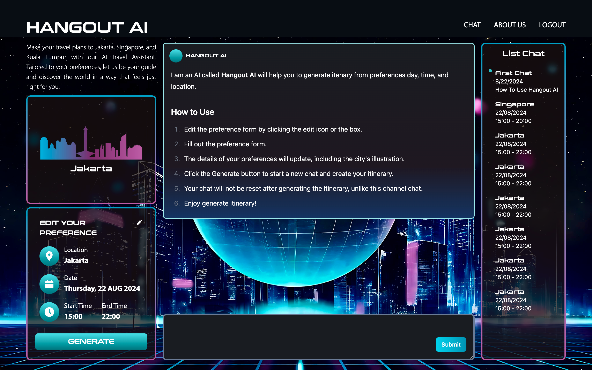
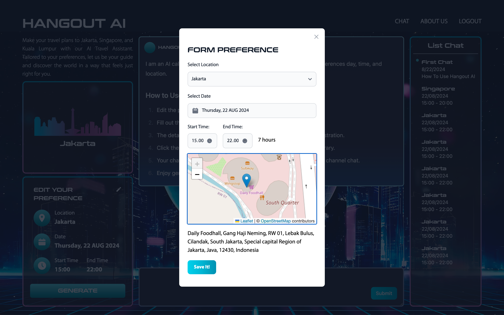
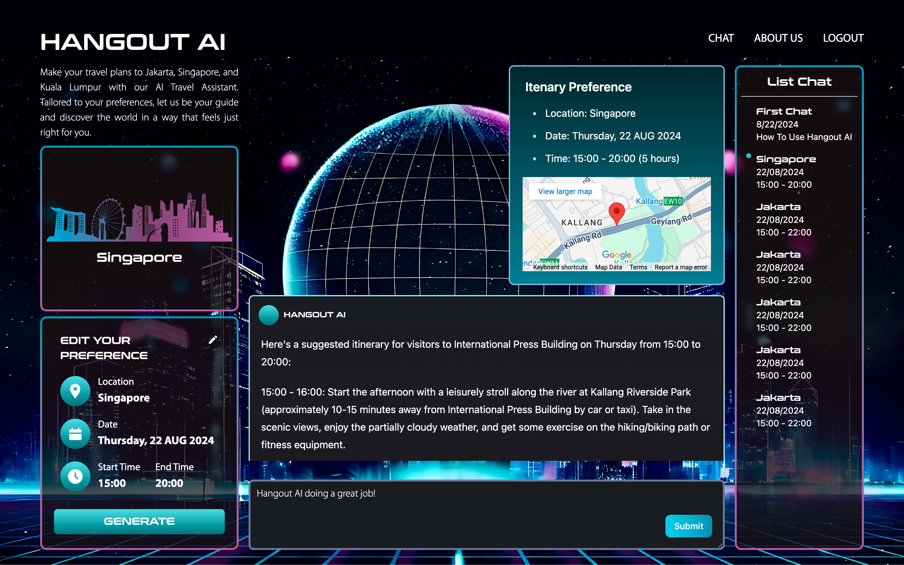
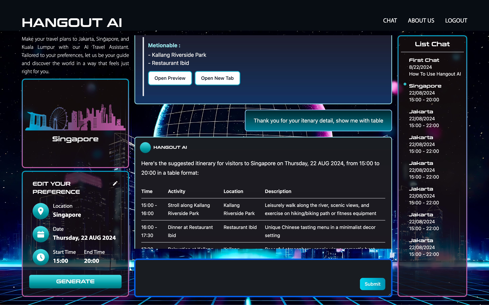

# Hangout AI Client

## Develop With Tech Stack
- React JS
- Vite
- Tailwind CSS
- Leaflet 
- Google Map
- React Flowbite
- React MArkdown 
- Google Oauth 
- Vercel 

## How To Run 

1. Git clone this repository 
2. Open the code folder / repo and run 
```bash 
$ npm install 
```
3. Create file .env with this template 
```
VITE_GROQ=
VITE_GMAP=
VITE_PUBLIC_KEY_TIDB=
VITE_PRIVATE_KEY_TIDB=
VITE_YOUTUBE=
```
4. Run the code with this command line
```bash
$ npm run dev
```

## Screenshot 

1. Landing Page 

> Users need to log in with the Google Sign-In option that we provide.  
> Note : We will change the YouTube link after we finish recording.

2. Chat Page 


> We set the default location to Jakarta, but if the user changes it to Singapore or Kuala Lumpur, the city illustration will change as well.
<br/>
<br/>



> Users can continue chatting with the AI, for example, by asking for a table. We have a preview button to show an image of the mentioned location or open a new tab to view the location on Google for more details and reviews.
<br/>
<br/>
